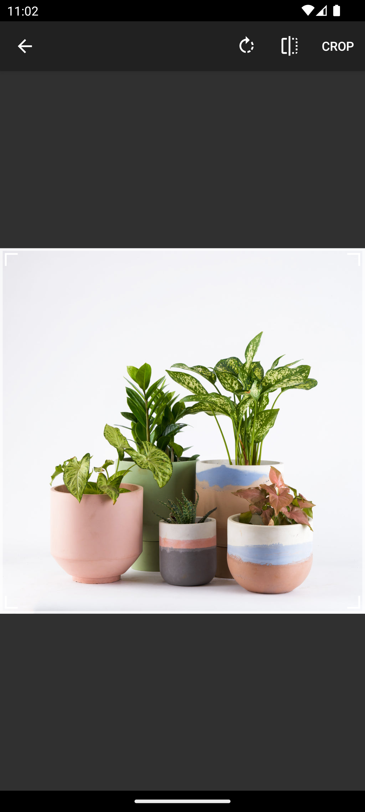
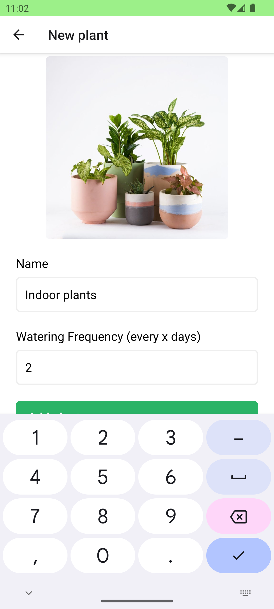

# Plantly


Plantly is an intuitive React Native application built with Expo, designed to help you keep your plants healthy and hydrated. It features a user-friendly interface for adding and managing plants, complete with watering schedules and reminders. With seamless image integration and quick actions, Plantly ensures that your plant care routine is both efficient and enjoyable.

## Features

### Plant Management

- Add new plants with names, watering frequency, and images.
- View detailed information about each plant.
- Delete plants from the list.
- Water plants and track the last watered date.

### Reminders

- Set watering schedules for each plant.
- Receive reminders to water your plants.

### Quick Actions

- Use quick actions to add new plants directly from the home screen.

### Image Integration

- Choose images for your plants from the device's gallery.
- Display plant images in the app.

### Onboarding

- Onboarding screen to guide new users through the app setup.

### Data Persistence

- Plant data is persisted using local storage with zustand and AsyncStorage.

## Screenshots

| Custom Icon                                                      | Splash Screen                                                      | Onboarding                                                      |
| ---------------------------------------------------------------- | ------------------------------------------------------------------ | --------------------------------------------------------------- |
|  |  |  |

| Home Screen                                                      | Add Plant                                                      | Pick Plant Image                                                      |
| ---------------------------------------------------------------- | -------------------------------------------------------------- | --------------------------------------------------------------------- |
|  |  |  |

| Crop Picked Image                                                      | Empty Form State                                                      | Filled Form State                                                      |
| ---------------------------------------------------------------------- | --------------------------------------------------------------------- | ---------------------------------------------------------------------- |
|  |  |  |

| Filled Form State Full                                                      | Home Screen with Plants                                                      | Plant Details                                                      |
| --------------------------------------------------------------------------- | ---------------------------------------------------------------------------- | ------------------------------------------------------------------ |
|  |  |  |

| Water Plant                                                      | Delete Plant                                                      | Quick Actions                                                      |
| ---------------------------------------------------------------- | ----------------------------------------------------------------- | ------------------------------------------------------------------ |
|  |  |  |

| Deep Linking                                                      |
| ----------------------------------------------------------------- |
|  |

## Development Commands

### Install

```bash
bunx expo install <package_name>
```

### Prebuild

```bash
bunx expo prebuild --platform android
```

### Run Android

```bash
bunx expo run:android
```

### Deep Link

#### Open plant detail screen

```bash
bunx uri-scheme open plantly://plants/<plantId> --android
```

#### Open plant detail screen with query params

```bash
bunx uri-scheme open plantly://plants/<plantId>\?action=water --android
```
